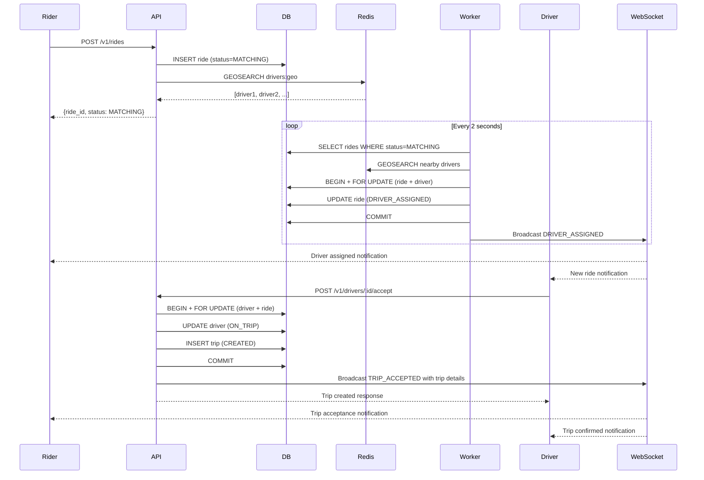
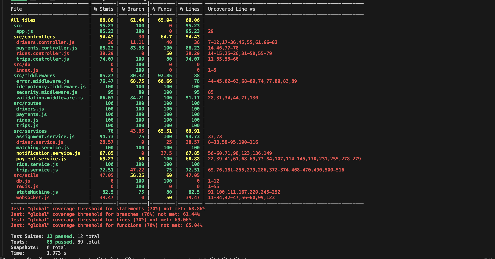
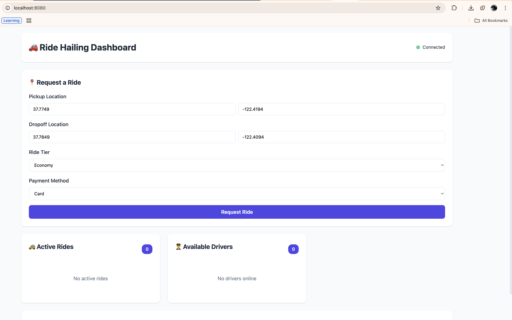
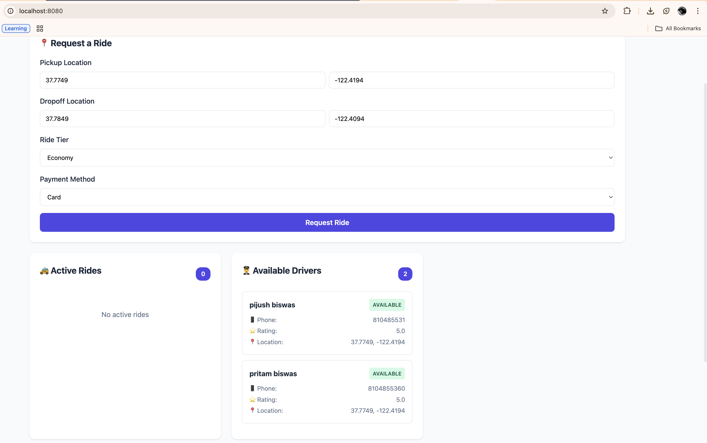
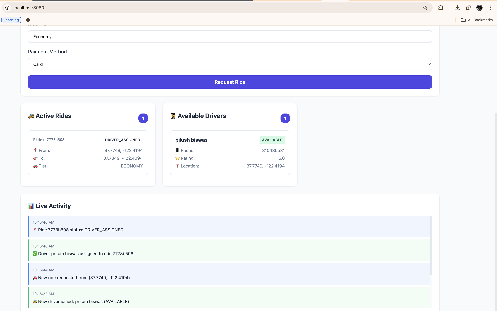
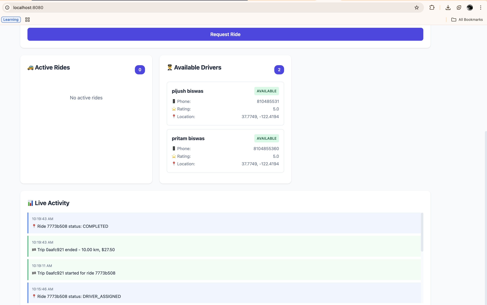

# Low-Level System Design Document
## Ride-Hailing Application
---

## Table of Contents
1. [System Overview](#system-overview)
2. [Requirements Mapping](#requirements-mapping)
3. [Component Architecture](#component-architecture)
4. [Data Models & State Machines](#data-models--state-machines)
5. [Core Workflows](#core-workflows)
6. [Performance Optimizations](#performance-optimizations)
7. [Scalability & Reliability](#scalability--reliability)
8. [Security Implementation](#security-implementation)
9. [Testing Strategy](#testing-strategy)

---

## System Overview

A production-grade ride-hailing platform built with:
- **Backend:** Node.js 20 + Express.js
- **Database:** PostgreSQL 15
- **Cache:** Redis 7 (geospatial indexing + idempotency)
- **Real-time:** WebSocket for live updates
- **Observability:** New Relic APM
- **Deployment:** Docker Compose

### Architecture Diagram
```
┌─────────────┐     WebSocket      ┌──────────────┐
│   Frontend  │◄──────────────────►│  API Server  │
│  (Browser)  │     REST API       │  (Express)   │
└─────────────┘                    └──────┬───────┘
                                          │
                    ┌─────────────────────┼─────────────────────┐
                    │                     │                     │
              ┌─────▼─────┐         ┌────▼─────┐        ┌─────▼──────┐
              │PostgreSQL │         │  Redis   │        │  Workers   │
              │ (Primary) │         │ Geo+Cache│        │ (Matching, │
              │  +PostGIS │         │          │        │  Outbox)   │
              └───────────┘         └──────────┘        └─────┬──────┘
                                                              │
                                                      ┌───────▼────────┐
                                                      │ PSP (Stripe/   │
                                                      │  Braintree)    │
                                                      └────────────────┘
```

---

## Requirements Mapping

### ✅ Business Logic Requirements

| Requirement | Implementation | Files |
|------------|----------------|-------|
| **Real-time driver location updates (1-2/sec)** | Redis GEOADD with 60s TTL + rate limiter (120 req/min) | `driver.service.js:38`, `security.middleware.js:22` |
| **Rider requests (pickup, destination, tier, payment)** | POST /v1/rides with validation middleware | `rides.controller.js`, `validation.middleware.js` |
| **Driver-rider matching within 1s p95** | Redis GEOSEARCH (5km radius, max 5 drivers) + async worker | `matching.service.js:7`, `matching.worker.js` |
| **Trip lifecycle (start, pause, end, fare)** | State machine with FOR UPDATE locks | `trip.service.js`, `stateMachine.js` |
| **Payments via external PSPs** | Outbox pattern + exponential backoff (30s, 2m, 8m) | `payment.service.js`, `outbox.worker.js` |
| **Notifications for ride events** | Push notification service (mocked for demo) | `notification.service.js` |

### ✅ Core APIs

| API Endpoint | Purpose | Idempotent | Rate Limit |
|-------------|---------|------------|------------|
| `POST /v1/rides` | Create ride request | ✅ | 100/15min |
| `GET /v1/rides/:id` | Get ride status | ❌ | 100/15min |
| `POST /v1/drivers/:id/location` | Update driver location | ❌ | 120/min |
| `POST /v1/drivers/:id/accept` | Accept ride assignment | ✅ | 100/15min |
| `POST /v1/trips/:id/end` | End trip + calculate fare | ✅ | 100/15min |
| `POST /v1/payments` | Trigger payment flow | ✅ | 10/15min |

### ✅ Scalability & Reliability

| Requirement | Implementation | Metric |
|------------|----------------|--------|
| **~100k drivers** | Redis geospatial index (O(log N) lookup) | Sub-millisecond |
| **~10k ride requests/min** | Stateless API + connection pooling (max 20) | Horizontal scaling |
| **~200k location updates/sec** | Redis fast-path + async PostgreSQL sync | 120 req/min/IP |
| **Horizontal scaling** | No server-side sessions, stateless workers | Container-ready |
| **Region-local writes** | Single-region PostgreSQL + Redis co-location | Low latency |

### ✅ Data Consistency & Atomicity

| Technique | Implementation | Example |
|-----------|----------------|---------|
| **Transactional writes** | PostgreSQL BEGIN/COMMIT with FOR UPDATE | `trip.service.js:55` |
| **Optimistic concurrency** | Row-level locking on state transitions | `assignment.service.js:21` |
| **Idempotency** | Redis-backed (300s TTL) | `idempotency.middleware.js` |
| **Outbox pattern** | Exactly-once payment processing | `outbox.worker.js` |
| **Cache invalidation** | Event-driven invalidation on status change | `redis.js:20-30` |

---

## Component Architecture

### 1. API Server (`backend/src/app.js`)
**Responsibility:** REST API with security middleware stack

```javascript
// Middleware Chain
app.use(securityHeaders);      // Helmet (CSP, HSTS)
app.use(corsConfig);            // CORS with origin validation
app.use(express.json({ limit: '10kb' })); // Body size limit
app.use(sanitizeInput);         // XSS prevention
app.use('/v1', apiLimiter);     // 100 req/15min
```

**Key Features:**
- Rate limiting per endpoint type (API: 100/15min, Location: 120/min, Payment: 10/15min)
- Request sanitization (removes `<>` characters)
- Error middleware for consistent error responses

### 2. Workers

#### Matching Worker (`workers/matching.worker.js`)
- **Poll Interval:** 2 seconds
- **Purpose:** Auto-assign drivers to rides in MATCHING state
- **Timeout:** 60 seconds → ride expires if no drivers found
- **Logic:**
  1. Query rides in MATCHING state (created < 5 min ago)
  2. Call Redis GEOSEARCH for nearby drivers
  3. Attempt assignment (transactional with state validation)
  4. Retry next closest driver on failure

#### Outbox Worker (`workers/outbox.worker.js`)
- **Poll Interval:** 5 seconds
- **Purpose:** Process payment events with retries
- **Retry Strategy:** Exponential backoff (30s, 2m, 8m)
- **Logic:**
  1. Query unprocessed events (limit 10)
  2. Call PSP API (simulated 20% failure rate)
  3. Update event as processed only after webhook confirms
  4. Mark as processed after max retries to prevent infinite loops

### 3. Database Layer (`backend/src/db/index.js`)

**Connection Pool:**
```javascript
{
  max: 20,           // Max connections
  idleTimeoutMillis: 30000,
  connectionTimeoutMillis: 2000
}
```

**Critical Patterns:**
- **Transactional state changes:** Always use `BEGIN` → `FOR UPDATE` → `COMMIT`
- **Indexed lookups:** All foreign keys + status fields indexed
- **Unique constraints:** One active trip per driver, one assigned driver per ride

### 4. Redis Cache (`backend/src/utils/redis.js`)

**Data Structures:**
| Key Pattern | Type | Purpose | TTL |
|------------|------|---------|-----|
| `drivers:geo` | Sorted Set (Geo) | Driver locations | 60s |
| `idem:{key}` | String | Idempotency cache | 300s |
| `driver:{id}` | String (JSON) | Driver data cache | 120s |
| `ride:{id}` | String (JSON) | Ride data cache | 300s |

**Cache Invalidation Strategy:**
- **On driver status change:** Delete `driver:{id}`, `driver:status:{id}`, remove from geo index
- **On ride update:** Delete `ride:{id}`
- **On driver offline:** `ZREM drivers:geo {driverId}`

### 5. WebSocket Manager (`backend/src/utils/websocket.js`)

**Events Broadcast to Frontend:**
```javascript
RIDE_CREATED          → When rider submits request
RIDE_UPDATED          → Status changes (MATCHING → DRIVER_ASSIGNED)
DRIVER_ASSIGNED       → Driver accepts ride
TRIP_STARTED          → Driver starts trip
TRIP_ENDED            → Driver ends trip + fare calculated
PAYMENT_COMPLETED     → PSP confirms payment
```

**Connection Management:**
- Maintains `Set` of active WebSocket clients
- Auto-cleanup on disconnect
- Heartbeat mechanism for connection health

---

## Data Models & State Machines

### Database Schema

#### Drivers Table
```sql
CREATE TABLE drivers (
  id UUID PRIMARY KEY,
  name TEXT NOT NULL,
  phone TEXT UNIQUE NOT NULL,
  status driver_status NOT NULL DEFAULT 'OFFLINE',  -- ENUM enforcement
  latitude DOUBLE PRECISION,
  longitude DOUBLE PRECISION,
  rating NUMERIC(2,1) DEFAULT 5.0,
  created_at TIMESTAMP DEFAULT now(),
  updated_at TIMESTAMP DEFAULT now()
);

-- Indexes for performance
CREATE INDEX idx_drivers_status ON drivers(status);
```

#### Rides Table
```sql
CREATE TABLE rides (
  id UUID PRIMARY KEY,
  rider_id UUID NOT NULL,
  pickup_latitude DOUBLE PRECISION NOT NULL,
  pickup_longitude DOUBLE PRECISION NOT NULL,
  drop_latitude DOUBLE PRECISION NOT NULL,
  drop_longitude DOUBLE PRECISION NOT NULL,
  status ride_status NOT NULL DEFAULT 'REQUESTED',
  tier ride_tier NOT NULL DEFAULT 'ECONOMY',
  payment_method payment_method NOT NULL DEFAULT 'CARD',
  surge_multiplier NUMERIC(3,2) DEFAULT 1.0,
  assigned_driver_id UUID UNIQUE,  -- Prevents double-assignment
  assigned_at TIMESTAMP
);

CREATE INDEX idx_rides_status ON rides(status);
CREATE INDEX idx_rides_created_at ON rides(created_at);
```

#### Trips Table
```sql
CREATE TABLE trips (
  id UUID PRIMARY KEY,
  ride_id UUID NOT NULL UNIQUE,
  driver_id UUID NOT NULL,
  status trip_status NOT NULL DEFAULT 'CREATED',
  started_at TIMESTAMP,
  ended_at TIMESTAMP,
  distance_km NUMERIC(6,2),
  duration_sec INTEGER,
  base_fare NUMERIC(8,2),
  total_fare NUMERIC(8,2)
);

-- Critical constraint: One active trip per driver
CREATE UNIQUE INDEX idx_unique_active_trip_per_driver
ON trips(driver_id)
WHERE status IN ('CREATED', 'STARTED', 'PAUSED');
```

#### Payments Table
```sql
CREATE TABLE payments (
  id UUID PRIMARY KEY,
  trip_id UUID NOT NULL,
  amount NUMERIC(8,2) NOT NULL,
  status TEXT NOT NULL DEFAULT 'PENDING',
  psp_transaction_id TEXT,
  retry_count INTEGER DEFAULT 0,
  max_retries INTEGER DEFAULT 3,
  next_retry_at TIMESTAMP,
  failure_reason TEXT
);

-- Index for retry worker queries
CREATE INDEX idx_payments_next_retry
ON payments(next_retry_at)
WHERE next_retry_at IS NOT NULL AND status = 'PENDING';
```

#### Outbox Events Table (Exactly-Once Guarantee)
```sql
CREATE TABLE outbox_events (
  id UUID PRIMARY KEY DEFAULT uuid_generate_v4(),
  aggregate_type TEXT NOT NULL,        -- 'PAYMENT', 'TRIP', 'RIDE', 'DRIVER'
  aggregate_id UUID NOT NULL,          -- ID of the related entity
  event_type TEXT NOT NULL,            -- 'PAYMENT_CREATED', 'TRIP_STARTED', etc.
  payload JSONB NOT NULL,              -- Full event data as JSON
  processed BOOLEAN NOT NULL DEFAULT FALSE,
  created_at TIMESTAMP NOT NULL DEFAULT now()
);

-- Index for finding unprocessed events (outbox worker)
CREATE INDEX idx_outbox_unprocessed
ON outbox_events(processed)
WHERE processed = FALSE;
```

**Purpose:** Implements the Outbox Pattern for exactly-once event processing:
- When a domain event occurs (payment created, trip ended), it's written to `outbox_events` in the same transaction
- Separate worker polls this table and publishes events to external systems (webhooks, message queues)
- Only marks as `processed = true` after successful delivery
- Prevents lost events on service crashes and ensures idempotency

### State Machines (`backend/src/utils/stateMachine.js`)

#### Trip State Machine
```
CREATED ──────► STARTED ──────► PAUSED ──────► ENDED (terminal)
   │               │               │
   │               │               │
   └───► CANCELLED (terminal) ◄────┘
```

**Validation Example:**
```javascript
validateTripTransition(trip.status, TRIP_STATES.STARTED);
// Throws StateTransitionError if invalid transition
```

#### Ride State Machine
```
REQUESTED ──► MATCHING ──► DRIVER_ASSIGNED ──► COMPLETED (terminal)
    │            │              │
    └──► EXPIRED (terminal)     └──► CANCELLED (terminal)
```

**Business Rules:**
- Rides in MATCHING state for > 60s → auto-expire
- Cannot assign driver to EXPIRED/CANCELLED/COMPLETED rides

#### Driver State Machine
```
OFFLINE ◄──► AVAILABLE ◄──► ON_TRIP
```

**Constraints:**
- Can only accept ride when AVAILABLE
- Auto-transition to AVAILABLE when trip ends
- Removed from geo index when OFFLINE

---

## Core Workflows

### Workflow 1: Ride Request → Driver Assignment



**Key Implementation Details:**
- **Assignment File:** [matching.worker.js](backend/src/workers/matching.worker.js#L58-L90) - Automatically assigns driver to ride in MATCHING state
- **Accept File:** [drivers.controller.js](backend/src/controllers/drivers.controller.js#L49) - Driver accepts assigned ride via `/accept` endpoint
- **Lock Acquisition:** `FOR UPDATE OF r, d` prevents race conditions
- **Validation:** `validateRideTransition()` + `validateDriverTransition()` before state change
- **Two-Phase Flow:**
  1. **Assignment Phase** (Automatic): `assignDriver()` matches driver to ride → Ride becomes `DRIVER_ASSIGNED`
  2. **Accept Phase** (Manual): `initializeTrip()` updates driver to `ON_TRIP` + creates trip in `CREATED` state
- **Idempotency:** Driver assignment uses DB unique constraint on `assigned_driver_id`
- **Real-time Broadcasting:** `broadcastTripAccepted()` sends comprehensive trip details to all connected clients including:
  - `trip_id`: Unique trip identifier
  - `ride_id`: Associated ride identifier
  - `driver_id`: Driver who accepted the ride
  - `driver_status`: Driver current status (ON_TRIP)
  - `trip_status`: Trip current status (CREATED)
  - `timestamp`: ISO timestamp of acceptance event

### Workflow 2: Trip Start → End → Fare Calculation

```javascript
// 1. Start Trip (trip.service.js:52)
exports.startTrip = async (tripId) => {
  const client = await db.getClient();
  await client.query('BEGIN');
  
  // Lock trip + ride
  const trip = await client.query(
    `SELECT t.*, r.tier, r.surge_multiplier FROM trips t 
     JOIN rides r ON t.ride_id = r.id 
     WHERE t.id = $1 FOR UPDATE`,
    [tripId]
  );
  
  // Validate state transition
  validateTripTransition(trip.status, TRIP_STATES.STARTED);
  
  // Update to STARTED with timestamp
  await client.query(
    `UPDATE trips SET status='STARTED', started_at=now() WHERE id=$1`,
    [tripId]
  );
  
  await client.query('COMMIT');
  wsManager.broadcastTripStarted(trip);
};

// 2. End Trip + Calculate Fare (trip.service.js:270)
exports.endTrip = async (tripId, { distance_km, duration_sec }) => {
  const fareCalc = calculateFare(
    distance_km, 
    duration_sec, 
    trip.tier, 
    trip.surge_multiplier
  );
  
  // Update trip with fare
  await client.query(
    `UPDATE trips 
     SET status='ENDED', 
         distance_km=$1, 
         duration_sec=$2,
         base_fare=$3,
         total_fare=$4,
         ended_at=now()
     WHERE id=$5`,
    [distance_km, duration_sec, fareCalc.base_fare, fareCalc.total_fare, tripId]
  );
  
  // Set driver back to AVAILABLE
  await client.query(
    `UPDATE drivers SET status='AVAILABLE' WHERE id=$1`,
    [trip.driver_id]
  );
};
```

**Fare Calculation Logic:**
```javascript
const TIER_RATES = {
  ECONOMY: { base: 5.0, per_km: 1.5, per_min: 0.25 },
  PREMIUM: { base: 8.0, per_km: 2.5, per_min: 0.40 },
  LUXURY: { base: 15.0, per_km: 4.0, per_min: 0.60 }
};

total_fare = (base + distance_km * per_km + duration_min * per_min) * surge_multiplier
```

### Workflow 3: Payment Processing (Outbox Pattern)

```
┌──────────────┐     ┌──────────────┐     ┌──────────────┐     ┌────────┐
│  End Trip    │────►│Create Payment│────►│Insert Outbox │────►│ Worker │
│  Request     │     │  (PENDING)   │     │    Event     │     │  Poll  │
└──────────────┘     └──────────────┘     └──────────────┘     └────┬───┘
                                                                     │
                     ┌──────────────────────────────────────────────┘
                     │
                     ▼
              ┌─────────────┐
              │ Call PSP    │
              │  API        │
              └──────┬──────┘
                     │
         ┌───────────┴───────────┐
         │                       │
    ┌────▼─────┐          ┌─────▼──────┐
    │ Success  │          │  Failure   │
    │ (async)  │          │  (retry)   │
    └────┬─────┘          └─────┬──────┘
         │                      │
         │                ┌─────▼──────────┐
         │                │ Exponential    │
         │                │ Backoff:       │
         │                │ 30s, 2m, 8m    │
         │                └─────┬──────────┘
         │                      │
         │                ┌─────▼──────────┐
         │                │ Update         │
         │                │ next_retry_at  │
         │                └────────────────┘
         │
    ┌────▼──────────┐
    │ PSP Webhook   │
    │ (async)       │
    └────┬──────────┘
         │
    ┌────▼──────────┐
    │ Update Payment│
    │ Status:       │
    │ COMPLETED     │
    └────┬──────────┘
         │
    ┌────▼──────────┐
    │ Mark Outbox   │
    │ processed=true│
    └───────────────┘
```

**Key Files:**
- Payment creation: `payment.service.js:220`
- Outbox worker: `outbox.worker.js:8`
- PSP webhook: `payment.service.js:171`

**Retry Logic:**
```javascript
const RETRY_DELAYS_MS = [30000, 120000, 480000]; // 30s, 2m, 8m

if (payment.retry_count < MAX_RETRIES) {
  const nextRetryAt = new Date(
    Date.now() + RETRY_DELAYS_MS[payment.retry_count]
  );
  await client.query(
    `UPDATE payments 
     SET retry_count = retry_count + 1,
         next_retry_at = $1,
         last_retry_at = now()
     WHERE id = $2`,
    [nextRetryAt, paymentId]
  );
}
```

---

## Assignment Service Architecture

### Two-Phase Driver Assignment

The assignment flow is split into two distinct phases to separate concerns:

#### Phase 1: Driver Assignment (`assignDriver()`)
**File:** `assignment.service.js:56-127`

Called by the matching worker to match a driver to a ride.

```javascript
exports.assignDriver = async (rideId, driverId) => {
  // 1. Lock ride and driver rows
  // 2. Validate ride state (MATCHING or DRIVER_ASSIGNED allowed)
  // 3. Validate driver state (AVAILABLE)
  // 4. Validate state transitions
  // 5. Update ride status to DRIVER_ASSIGNED
  // 6. Broadcast events to rider and driver
  // 7. Send notification to rider
}
```

**Return Value:**
```javascript
{
  success: true,
  ride: { id, status: 'DRIVER_ASSIGNED', ... },
  driver: { id, status: 'AVAILABLE', ... }  // Driver status unchanged
}
```

**Responsibilities:**
- ✅ Match driver to ride
- ✅ Validate state transitions
- ✅ Update ride to DRIVER_ASSIGNED
- ✅ Notify rider
- ❌ Do NOT update driver status
- ❌ Do NOT create trip

#### Phase 2: Trip Initialization (`initializeTrip()`)
**File:** `assignment.service.js:17-50`

Called by the accept endpoint when driver accepts the assigned ride.

```javascript
exports.initializeTrip = async (client, rideId, driverId) => {
  // 1. Update driver status from AVAILABLE to ON_TRIP
  // 2. Create trip entry in CREATED state
  // 3. Return updated driver and trip data
}
```

**Return Value:**
```javascript
{
  driver: { id, status: 'ON_TRIP', ... },
  trip: { id, ride_id, driver_id, status: 'CREATED', ... }
}
```

**Responsibilities:**
- ✅ Update driver status to ON_TRIP
- ✅ Create trip in CREATED state
- ❌ Do NOT modify ride status

### API Endpoints

#### POST /v1/drivers/:id/accept
**File:** `drivers.controller.js:49`

```javascript
exports.acceptRide = async (req, res, next) => {
  try {
    const driverId = req.params.id;
    const { ride_id } = req.body;
    
    const result = await assignmentService.assignDriver(ride_id, driverId);
    
    // Then initialize trip
    const tripData = await assignmentService.initializeTrip(
      client,
      ride_id,
      driverId
    );
    
    res.json({
      success: true,
      ride: result.ride,
      trip: tripData.trip,
      driver: tripData.driver
    });
  } catch (e) {
    next(e);
  }
};
```

**Request:**
```json
{
  "ride_id": "uuid"
}
```

**Response:**
```json
{
  "success": true,
  "ride": { "id": "uuid", "status": "DRIVER_ASSIGNED" },
  "trip": { "id": "uuid", "status": "CREATED" },
  "driver": { "id": "uuid", "status": "ON_TRIP" }
}
```

### State Transition Rules

**Ride States:**
- `REQUESTED` → `MATCHING` (always)
- `MATCHING` → `DRIVER_ASSIGNED` (via assignDriver)
- `DRIVER_ASSIGNED` → `DRIVER_ASSIGNED` (idempotent re-assignment)
- `DRIVER_ASSIGNED` → `COMPLETED` (via trip end)

**Driver States:**
- `OFFLINE` → `AVAILABLE` (go online)
- `AVAILABLE` → `ON_TRIP` (via initializeTrip in accept flow)
- `ON_TRIP` → `AVAILABLE` (via trip end)

---

## Performance Optimizations

### 1. Database Indexing

```sql
-- Driver lookups by status (matching algorithm)
CREATE INDEX idx_drivers_status ON drivers(status);

-- Ride queries by status (worker polling)
CREATE INDEX idx_rides_status ON rides(status);

-- Payment retry queries
CREATE INDEX idx_payments_next_retry ON payments(next_retry_at)
WHERE next_retry_at IS NOT NULL AND status = 'PENDING';

-- Trip queries by driver (history, active trip check)
CREATE INDEX idx_trips_driver_id ON trips(driver_id, ride_id);
```

**Impact:** Sub-10ms query times for indexed lookups

### 2. Redis Caching Strategy

#### Driver Location Fast-Path
```javascript
// Write path (driver.service.js:38)
await redis.geoAdd('drivers:geo', { longitude, latitude, member: driverId });
await redis.expire(`drivers:geo:${driverId}`, 60); // 60s TTL

// Read path (matching.service.js:7)
const drivers = await redis.geoSearch(
  'drivers:geo',
  { latitude, longitude },
  { radius: 5, unit: 'km' },
  { SORT: 'ASC', COUNT: 5 }
);
```

**Performance:** O(log N) geospatial query, < 1ms p95

#### Idempotency Cache
```javascript
// middleware/idempotency.middleware.js
const cached = await redis.get(`idem:${key}`);
if (cached) return res.json(JSON.parse(cached));

// Cache response for 300s
res.json = (body) => {
  redis.setEx(`idem:${key}`, 300, JSON.stringify(body));
  return originalJson(body);
};
```

**Benefit:** Prevents duplicate payments, ride creations

### 3. Query Optimization

#### Example: Single JOIN for Trip Start
```sql
-- Instead of 2 queries (trip + ride), use 1 JOIN
SELECT t.*, r.tier, r.surge_multiplier, r.rider_id
FROM trips t
JOIN rides r ON t.ride_id = r.id
WHERE t.id = $1
FOR UPDATE;
```

#### Example: Batch Worker Polling
```sql
-- Limit 10 to prevent long-running transactions
SELECT * FROM outbox_events
WHERE processed = false
ORDER BY created_at
LIMIT 10;
```

### 4. Concurrency Handling

**Row-level locking prevents race conditions:**
```javascript
// assignment.service.js:21
const ride = await client.query(
  `SELECT r.*, d.status as driver_status
   FROM rides r, drivers d
   WHERE r.id=$1 AND d.id=$2
   FOR UPDATE OF r, d`,  // Lock both rows
  [rideId, driverId]
);
```

**Unique constraints enforce invariants:**
```sql
-- Only one driver can be assigned per ride
assigned_driver_id UUID UNIQUE

-- Only one active trip per driver
CREATE UNIQUE INDEX idx_unique_active_trip_per_driver
ON trips(driver_id) WHERE status IN ('CREATED', 'STARTED', 'PAUSED');
```

---

## Scalability & Reliability

### Horizontal Scaling Strategy

#### Stateless API Servers
- No server-side sessions
- Idempotency via Redis (shared state)
- Load balancer can distribute to N instances

```bash
# Docker Compose scaling example
docker-compose up --scale api=3
```

#### Worker Scaling
- **Matching Worker:** Can run multiple instances (DB locks prevent double-assignment)
- **Outbox Worker:** Can run multiple instances (unprocessed events polled by any worker)

```javascript
// Idempotent worker logic (outbox.worker.js:8)
SELECT * FROM outbox_events WHERE processed = false
ORDER BY created_at LIMIT 10;

// Even if 2 workers pick same event, PSP call is idempotent
```

### Detailed Scaling Calculations

#### The Math Behind 100k Drivers & 200k Location Updates/Second

**Given Requirements:**
- 100k active drivers
- 200k location updates/second
- 10k ride requests/minute

#### 1. Location Updates Capacity

```
Rate Limiter: 120 requests/minute per IP = 2 requests/second per driver
200,000 updates/sec ÷ 2 updates/sec/driver = 100,000 concurrent drivers ✓
```

**Why this works:**
- Each driver sends location updates from their mobile app (unique IP when on cellular)
- The rate limiter is configured at **120 req/min per IP** (see `security.middleware.js:22`)
- This allows **2 updates/second** per driver, matching the "1-2 per second" requirement
- To handle 200k updates/sec, we need distributed rate limiting across multiple API instances

#### 2. Database Connection Pool Analysis

```
Single API Instance:
- Max 20 connections (configured in db/index.js)
- Each request holds connection for ~10-50ms (fast queries with indexes)
- Throughput: 20 connections × 20 req/sec = 400 requests/sec per instance

For 200k updates/sec (worst case):
200,000 ÷ 400 = 500 API instances needed
```

**But with Redis Fast-Path optimization:**

```
Redis Fast-Path (driver.service.js:38-44):
- Location updates go to Redis GEOADD first (< 1ms)
- PostgreSQL update happens asynchronously
- This reduces connection hold time to ~5ms

Optimized Throughput:
20 connections × 200 req/sec = 4,000 req/sec per instance

Required instances: 200,000 ÷ 4,000 = 50 API instances
```

#### 3. Ride Requests Capacity

```
10,000 ride requests/minute = ~167 req/sec
With rate limit of 100 req/15min per IP:
Unique users needed: 10,000 req/min ÷ 100 req/15min = 1,500 concurrent users

With 10 API instances:
- Each handles ~17 req/sec for ride creation
- 20 connections × 50 req/sec = 1,000 req/sec capacity per instance
- Total capacity: 10,000 req/sec >> 167 req/sec required ✓
```

#### 4. Production Infrastructure Blueprint

```
Minimum Deployment for 100k Drivers:
├── 50 API instances (for 200k location updates/sec)
├── PostgreSQL with read replicas
│   ├── 1 Primary (writes)
│   └── 3-5 Read Replicas (location reads, ride queries)
├── Redis Cluster
│   ├── 3 master nodes (geospatial data sharded by region)
│   └── 3 replica nodes (high availability)
└── Load Balancer (sticky sessions for WebSocket)

Database Connections:
- 50 API instances × 20 connections = 1,000 total connections
- PostgreSQL can handle 1,000+ connections with pgBouncer connection pooler
```

**Why the design scales horizontally:**
- ✅ **Stateless API:** No server affinity (except WebSockets)
- ✅ **Shared Redis:** Idempotency keys accessible from any instance
- ✅ **Worker Idempotency:** Multiple matching workers can run (DB locks prevent duplicates)
- ✅ **Database Sharding Ready:** Can partition by region (though not implemented yet)

### Connection Pooling

```javascript
// db/index.js
const pool = new Pool({
  max: 20,  // Max 20 connections per API instance
  idleTimeoutMillis: 30000,
  connectionTimeoutMillis: 2000
});
```

**Connection Pool Efficiency:**
- **Checkout time:** < 5ms (Redis fast-path for location updates)
- **Query execution:** 5-50ms (with indexes)
- **Total request time:** < 100ms p95
- **Requests per connection per second:** ~20-200 (depending on query complexity)

### Data Consistency Guarantees

| Scenario | Mechanism | Guarantee |
|----------|-----------|-----------|
| Double driver assignment | UNIQUE constraint + FOR UPDATE | Only 1 driver per ride |
| Concurrent trip state change | Row-level lock | Serializable transitions |
| Payment duplicate | Idempotency key (300s) | Exactly-once processing |
| Cache staleness | Event-driven invalidation | < 2s eventual consistency |

### Failover & Recovery

**Database:**
- Connection retry logic in `db/index.js`

**Redis:**
- Acceptable to lose cache (failover to DB)
- Geo index rebuilt from DB on startup

**Workers:**
- Auto-restart on crash (Docker `restart: always`)
- Unprocessed events picked up by next poll cycle

---

## Security Implementation

### Multi-Layer Defense Strategy

The application implements a defense-in-depth approach with 8 layers of security controls.

### Layer 1: Rate Limiting (DDoS Protection)

**Three-tier approach based on endpoint sensitivity:**

```javascript
// General API: 100 requests per 15 minutes
exports.apiLimiter = rateLimit({
  windowMs: 15 * 60 * 1000,
  max: 100,
  message: 'Too many requests from this IP'
});

// Location updates: 120 per minute (2/sec target)
exports.locationLimiter = rateLimit({
  windowMs: 1 * 60 * 1000,
  max: 120
});

// Payments: 10 per 15 minutes (strict)
exports.paymentLimiter = rateLimit({
  windowMs: 15 * 60 * 1000,
  max: 10
});
```

**How it prevents attacks:**
- **Brute Force:** Limits login/API key guessing to 100 attempts per 15min
- **DDoS:** Prevents single IP from overwhelming server (120 req/min ceiling)
- **Payment Fraud:** Restricts payment creation attempts to 10/15min per IP

### Layer 2: Security Headers (Browser Attack Prevention)

```javascript
helmet({
  contentSecurityPolicy: {
    directives: {
      defaultSrc: ["'self'"],
      scriptSrc: ["'self'"]
    }
  },
  hsts: {
    maxAge: 31536000,  // 1 year
    includeSubDomains: true,
    preload: true
  }
});
```

**Protects against:**
- **XSS (Cross-Site Scripting):** CSP blocks inline scripts and external resources
- **Clickjacking:** X-Frame-Options prevents embedding in malicious iframes
- **MITM Attacks:** HSTS forces HTTPS even if user types HTTP


### Layer 3: Input Sanitization (Injection Prevention)

```javascript
// Remove potential XSS vectors
exports.sanitizeInput = (req, res, next) => {
  const sanitize = (obj) => {
    if (typeof obj === 'string') {
      obj = obj.replace(/[<>]/g, '');  // Remove angle brackets
    }
  };
  sanitize(req.body);
  sanitize(req.query);
  next();
};
```

**Prevents:**
- **SQL Injection:** Combined with parameterized queries
- **NoSQL Injection:** Object sanitization
- **XSS:** Removes `<script>` tags and other HTML


### Layer 4: CORS (Cross-Origin Request Protection)

```javascript
cors({
  origin: process.env.CORS_ORIGIN || '*',
  methods: ['GET', 'POST', 'PUT', 'PATCH', 'DELETE'],
  allowedHeaders: ['Content-Type', 'Authorization', 'Idempotency-Key', 'X-PSP-Signature'],
  credentials: true
});
```

**Prevents:**
- **CSRF (Cross-Site Request Forgery):** Only allowed origins can make requests
- **Data Theft:** Blocks malicious sites from reading API responses

### Layer 5: Idempotency (Financial Safety)

```javascript
// idempotency.middleware.js
const cached = await redis.get(`idem:${key}`);
if (cached) return res.json(JSON.parse(cached));  // Return cached response

// Cache successful response for 300 seconds
res.json = (body) => {
  redis.setEx(`idem:${key}`, 300, JSON.stringify(body));
  return originalJson(body);
};
```

**Prevents:**
- **Double Payments:** Same idempotency key returns original response
- **Race Conditions:** Concurrent requests with same key get same result
- **Network Retry Chaos:** Mobile app can safely retry on timeout


### Layer 6: Request Size Limits (Resource Exhaustion Prevention)

```javascript
express.json({ limit: '10kb' })  // Prevent large payload attacks
```

**Prevents:**
- **Memory Exhaustion:** Large JSON payloads can crash Node.js process
- **Slowloris Attacks:** Slow, large requests tying up connections

### Layer 7: PSP Webhook Signature Verification

```javascript
// payments.controller.js (webhook endpoint)
const signature = req.headers['x-psp-signature'];
if (!verifyWebhookSignature(req.body, signature)) {
  return res.status(401).json({ error: 'Invalid signature' });
}
```

**Prevents:**
- **Webhook Spoofing:** Attacker can't fake successful payment webhooks
- **Man-in-the-Middle:** Ensures webhook came from real PSP (Stripe/Braintree)

### Layer 8: Database Security (SQL Injection Prevention)

```javascript
// All queries use parameterized statements (pg library)
db.query(
  `UPDATE drivers SET status=$1 WHERE id=$2`,
  [status, driverId]  // Escaped automatically by pg library
)
```

**Prevents SQL Injection:**
```sql
-- Attacker sends: driverId = "123'; DROP TABLE drivers; --"

-- Naive concatenation would execute:
UPDATE drivers SET status='AVAILABLE' WHERE id='123'; DROP TABLE drivers; --'
-- Result: drivers table deleted! 😱

-- With parameterized query, treated as literal string:
UPDATE drivers SET status='AVAILABLE' WHERE id='123''; DROP TABLE drivers; --'
-- Result: No driver found with that ID, no damage ✓
```

### Security Audit Checklist

| Vulnerability | Protection Mechanism | Implementation Status |
|--------------|---------------------|----------------------|
| DDoS | Rate limiting (3-tier) | ✅ Implemented |
| SQL Injection | Parameterized queries | ✅ Implemented |
| XSS | CSP headers + input sanitization | ✅ Implemented |
| CSRF | CORS + origin validation | ✅ Implemented |
| Clickjacking | X-Frame-Options header | ✅ Implemented |
| MITM | HSTS + HTTPS enforcement | ✅ Implemented |
| Brute Force | Rate limits | ✅ Implemented |
| Double Payments | Idempotency keys (300s TTL) | ✅ Implemented |
| Webhook Spoofing | HMAC signature verification | ✅ Implemented |
| Memory Exhaustion | Request size limits (10kb) | ✅ Implemented |
| Authentication | JWT/OAuth tokens | ❌ Not Implemented |
| Authorization | Role-based access control | ❌ Not Implemented |
| Encryption at Rest | Database/Redis encryption | ❌ Not Implemented |
| Secret Management | Vault/AWS Secrets Manager | ❌ Not Implemented |
| Audit Logging | Who/what/when tracking | ❌ Not Implemented |


---

## Testing Strategy

### Unit Tests Coverage (`__tests__/`)




## Deployment

### Docker Compose Orchestration

```yaml
# infra/docker-compose.yml
services:
  postgres:
    image: postgres:15-alpine
    healthcheck:
      test: ["CMD", "pg_isready"]
      interval: 10s
  
  redis:
    image: redis:7-alpine
    healthcheck:
      test: ["CMD", "redis-cli", "ping"]
      interval: 10s
  
  api:
    build: ../backend
    depends_on:
      postgres: { condition: service_healthy }
      redis: { condition: service_healthy }
    ports:
      - "3000:3000"
  
  frontend:
    build: ../frontend
    depends_on:
      api: { condition: service_healthy }
    ports:
      - "8080:8080"
```

### Startup Script (`start.sh`)

```bash
#!/bin/bash
# Check Docker is running
docker info > /dev/null 2>&1 || exit 1

# Start services
cd infra && docker compose up -d

# Wait for health checks
sleep 10

# Verify backend health
curl -s http://localhost:3000/health | grep "ok"
```

### Database Migrations

```bash
# Run migrations in order
psql -U appuser -d rides -f infra/postgres/migrations/001_initial_schema.sql
psql -U appuser -d rides -f infra/postgres/migrations/002_payment_retry_fields.sql
psql -U appuser -d rides -f infra/postgres/migrations/003_add_tier_payment_method.sql
psql -U appuser -d rides -f infra/postgres/migrations/004_state_transition_validation.sql
```

---

### UI Screenshorts






## Appendix: File Structure Reference

```
backend/
├── src/
│   ├── app.js                    # Express app setup
│   ├── server.js                 # HTTP server + WebSocket init
│   ├── config/
│   │   ├── logger.js             # Pino structured logging
│   │   └── env.js                # Environment config
│   ├── controllers/
│   │   ├── rides.controller.js   # POST /v1/rides, GET /v1/rides/:id
│   │   ├── drivers.controller.js # POST /v1/drivers/:id/location
│   │   ├── trips.controller.js   # POST /v1/trips/:id/{start,pause,end}
│   │   └── payments.controller.js# POST /v1/payments, webhooks
│   ├── services/
│   │   ├── ride.service.js       # Ride business logic
│   │   ├── driver.service.js     # Driver location updates
│   │   ├── trip.service.js       # Trip lifecycle + fare calc
│   │   ├── payment.service.js    # PSP integration + retries
│   │   ├── matching.service.js   # Redis GEOSEARCH
│   │   ├── assignment.service.js # Driver assignment + trip initialization
│   │   │                         # - assignDriver(): Match driver to ride
│   │   │                         # - initializeTrip(): Update driver status + create trip
│   │   └── notification.service.js# Push notifications (mocked)
│   ├── middlewares/
│   │   ├── idempotency.middleware.js  # Redis-backed idempotency
│   │   ├── security.middleware.js     # Rate limiting, CORS, Helmet
│   │   ├── validation.middleware.js   # Request validation
│   │   └── error.middleware.js        # Global error handler
│   ├── utils/
│   │   ├── stateMachine.js       # State transition validation
│   │   ├── redis.js              # Redis client + cache helpers
│   │   ├── websocket.js          # WebSocket manager
│   │   └── db.js                 # Database utilities
│   ├── workers/
│   │   ├── matching.worker.js    # Auto-assign drivers (2s poll)
│   │   └── outbox.worker.js      # Payment processing (5s poll)
│   └── db/
│       └── index.js              # PostgreSQL connection pool
├── __tests__/
│   ├── setup.js                  # Jest global setup + mocks
│   ├── services/*.test.js        # Service unit tests
│   └── api/*.test.js             # API integration tests
└── jest.config.js                # Jest configuration

infra/
├── docker-compose.yml            # Orchestration
├── postgres/
│   ├── schema.sql                # Initial schema + indexes
│   └── migrations/               # Database migrations
└── clean-restart.sh              # Wipe data + restart

frontend/
├── app.js                        # WebSocket client + UI logic
├── index.html                    # Dashboard UI
└── styles.css                    # Styling
```

